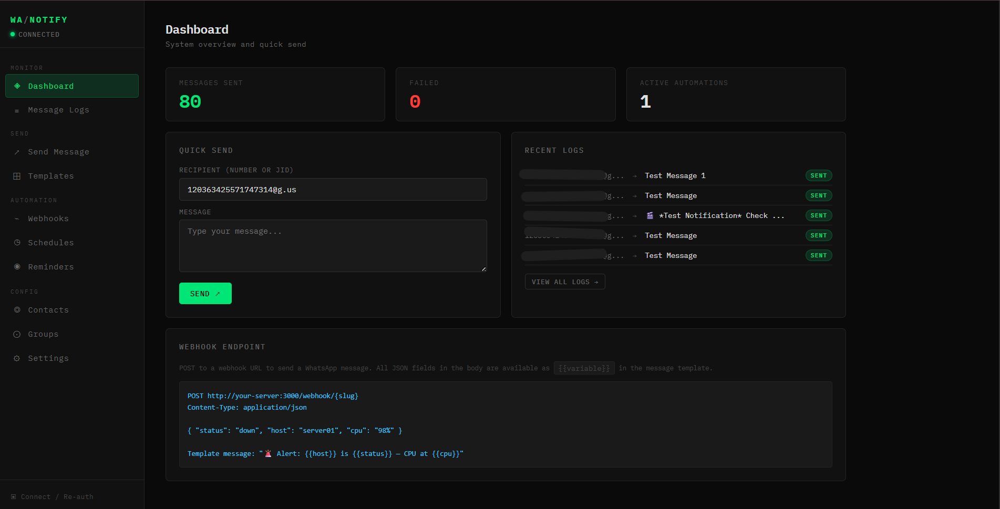

# WA Notifier

A self-hosted WhatsApp notification hub with a web UI, REST API, webhooks, scheduled messages, and reminders — all without needing the official WhatsApp Business API.

Built on [Baileys](https://github.com/WhiskeySockets/Baileys), it links to your personal WhatsApp account via QR code, exactly like WhatsApp Web.



---

## Features

- **Web UI** — Sleek dark terminal-style dashboard to manage everything from a browser
- **REST API** — Send messages or files programmatically with API key authentication
- **Webhooks** — POST any JSON payload to a named endpoint and forward it as a WhatsApp message. All JSON fields are available as `{{variable}}` in message templates
- **Jellyfin Integration** — Built-in webhook handler for Jellyfin media server events
- **Scheduled Messages** — Full cron expression support for timed broadcasts
- **Reminders** — Simple recurring reminders (daily, weekdays, weekends, weekly, or hourly)
- **Message Templates** — Reusable messages with `{{variable}}` substitution
- **Rich Media** — Send images, video, audio, PDFs, and documents — via file upload or URL
- **Contacts & Groups** — Manage recipients with names and organize WhatsApp group JIDs
- **Message Logs** — Full history of every sent message with source and status
- **Persistent Auth** — WhatsApp session is saved to disk; survives restarts without re-scanning

---

## Installation

> **Prerequisites:** [Docker Desktop](https://docs.docker.com/get-docker/) (Windows/Mac) or Docker Engine + Docker Compose (Linux). A WhatsApp account to link.

---

### Docker Compose

Copy the following into a `docker-compose.yml` file, then run `docker compose up -d`.

```yaml
services:
  wa-notifier:
    image: cybermask367/wa-notifier:latest
    container_name: wa-notifier
    restart: unless-stopped
    ports:
      - "3000:3000"
    volumes:
      - $DATA_DIR:/data
    environment:
      - PORT=3000
      - DATA_DIR=/data
      - SESSION_DIR=/data/session
```

> **Windows:** change the volume path to `what ever you want` and make sure Docker Desktop is running.

---

### Docker CLI

<details>
<summary><b>🐧 Linux</b></summary>

```bash
docker run -d \
  --name wa-notifier \
  --restart unless-stopped \
  -p 3000:3000 \
  -v $DATA_DIR:/data \
  -e PORT=3000 \
  -e DATA_DIR=/data \
  -e SESSION_DIR=/data/session \
  cybermask367/wa-notifier:latest
```

</details>

<details>
<summary><b>🪟 Windows (PowerShell)</b></summary>

```powershell
docker run -d `
  --name wa-notifier `
  --restart unless-stopped `
  -p 3000:3000 `
  -v C:\AppData\wa-notifier\data:/data `
  -e PORT=3000 `
  -e DATA_DIR=/data `
  -e SESSION_DIR=/data/session `
  cybermask367/wa-notifier:latest
```

> Docker Desktop must be running before executing these commands.

</details>

Once running, open `http://your_ip_address:3000` and scan the QR code to link your WhatsApp account.

---

### 🔨 Building from source (optional)

<details>
<summary>Click to expand</summary>

```bash
git clone https://github.com/CyberMask367/wa-notifier.git
cd whatsapp-notifier
```

**Docker Compose**
```bash
docker compose up -d --build
```

**Docker CLI — Linux**
```bash
docker build -t wa-notifier .
docker run -d \
  --name wa-notifier \
  --restart unless-stopped \
  -p 3000:3000 \
  -v /DATA/AppData/wa-notifier/data:/data \
  wa-notifier
```

**Docker CLI — Windows**
```powershell
docker build -t wa-notifier .
docker run -d `
  --name wa-notifier `
  --restart unless-stopped `
  -p 3000:3000 `
  -v C:\AppData\wa-notifier\data:/data `
  wa-notifier
```

**Node.js (no Docker)**
```bash
npm install
npm start
# or for development with auto-reload:
npm run dev
```

</details>

---

## Configuration

| Environment Variable | Default | Description |
|---|---|---|
| `PORT` | `3000` | HTTP server port |
| `DATA_DIR` | `/data` | Directory for SQLite database and uploaded files |
| `SESSION_DIR` | `/data/session` | Directory for WhatsApp session credentials |

For Docker, these are set in `docker-compose.yml`. For bare Node, set them in your shell or a `.env` file.

---

## Linking Your WhatsApp Account

1. Open the web UI at `http://your_ip_address:3000`
2. Click **Connect / Re-auth** in the sidebar footer
3. Open WhatsApp on your phone → **Linked Devices** → **Link a Device**
4. Scan the QR code shown in the modal

The session is persisted to disk — you only need to scan once. If you are logged out, the session directory is automatically cleared and a new QR code is generated.

---

## Managing Contacts & Groups

### Contacts

Contacts are individual phone numbers you send messages to. To add one, go to **Contacts** in the sidebar and fill in:

- **Name** — a label for the contact (e.g. "John", "Alert Phone")
- **Phone Number** — in international format, no spaces, no `+` (e.g. `2348012345678`)
- **Notes** — optional, anything you want

Once saved, the contact appears in every recipient dropdown across the app — in Send, Webhooks, Schedules, and Reminders.

> 💡 You can also type a number directly into the **custom number/JID** field on the Send page without saving it as a contact first.

---

### Groups

You can send messages to WhatsApp groups by saving their **JID** (a unique group identifier that looks like `120363XXXXXXXXXX@g.us`).

To add a group, go to **Groups** in the sidebar and fill in:

- **Group Name** — a label so you can identify it (e.g. "Dev Team", "Family")
- **Group JID** — the group's unique ID ending in `@g.us`
- **Notes** — optional

Once saved, the group appears alongside contacts in every recipient dropdown.

#### How to find your Group JID

> Here's a short video showing exactly how to find your WhatsApp Group JID.


https://github.com/user-attachments/assets/00e42b64-0aa5-427d-83ad-b1cb2595c696


---

## REST API

All write endpoints require an API key sent as the `x-api-key` request header. The default key is auto-generated on first run and is visible (and configurable) in **Settings** in the web UI.

### Send a text message

```http
POST /api/send
x-api-key: your-api-key
Content-Type: application/json

{
  "to": "2348012345678",
  "message": "Hello from WA Notifier!"
}
```

Send to multiple recipients by passing an array:

```json
{
  "to": ["2348012345678", "2349087654321"],
  "message": "Broadcast message"
}
```

Send to a WhatsApp group by using the group JID:

```json
{
  "to": "120363XXXXXXXXXX@g.us",
  "message": "Hello team!"
}
```

### Send using a saved template

```http
POST /api/send
x-api-key: your-api-key
Content-Type: application/json

{
  "to": "2348012345678",
  "template": "server-alert",
  "vars": {
    "host": "web01",
    "status": "down",
    "cpu": "98%"
  }
}
```

### Send a file from a URL

```http
POST /api/send
x-api-key: your-api-key
Content-Type: application/json

{
  "to": "2348012345678",
  "url": "https://example.com/report.pdf",
  "caption": "Monthly report"
}
```

### Send a file via multipart upload

```bash
curl -X POST http://your_ip_address:3000/api/send-file \
  -H "x-api-key: your-api-key" \
  -F "to=2348012345678" \
  -F "file=@/path/to/image.jpg" \
  -F "caption=Check this out"
```

Supports images, video, audio, PDFs, Office documents, and more — up to 64 MB.

### API Endpoints Reference

| Method | Path | Auth | Description |
|--------|------|------|-------------|
| `GET` | `/api/status` | — | WhatsApp connection status and QR data URL |
| `POST` | `/api/logout` | — | Disconnect WhatsApp session |
| `POST` | `/api/send` | ✓ | Send text, template, or URL-based media |
| `POST` | `/api/send-file` | ✓ | Send a file via multipart upload |
| `GET` | `/api/contacts` | — | List contacts |
| `POST` | `/api/contacts` | — | Create a contact |
| `PUT` | `/api/contacts/:id` | — | Update a contact |
| `DELETE` | `/api/contacts/:id` | — | Delete a contact |
| `GET` | `/api/groups` | — | List groups |
| `POST` | `/api/groups` | — | Add a group |
| `DELETE` | `/api/groups/:id` | — | Remove a group |
| `GET` | `/api/templates` | — | List templates |
| `POST` | `/api/templates` | — | Create a template |
| `PUT` | `/api/templates/:id` | — | Update a template |
| `DELETE` | `/api/templates/:id` | — | Delete a template |
| `GET` | `/api/schedules` | — | List schedules |
| `POST` | `/api/schedules` | — | Create a schedule |
| `PUT` | `/api/schedules/:id` | — | Update/toggle a schedule |
| `DELETE` | `/api/schedules/:id` | — | Delete a schedule |
| `GET` | `/api/reminders` | — | List reminders |
| `POST` | `/api/reminders` | — | Create a reminder |
| `PUT` | `/api/reminders/:id` | — | Update/toggle a reminder |
| `DELETE` | `/api/reminders/:id` | — | Delete a reminder |
| `GET` | `/api/webhook-rules` | — | List webhook rules |
| `POST` | `/api/webhook-rules` | — | Create a webhook rule |
| `PUT` | `/api/webhook-rules/:id` | — | Update/toggle a rule |
| `DELETE` | `/api/webhook-rules/:id` | — | Delete a webhook rule |
| `GET` | `/api/logs` | — | Paginated message logs |
| `DELETE` | `/api/logs` | — | Clear all logs |
| `GET` | `/api/settings` | — | Get settings |
| `PUT` | `/api/settings` | — | Update settings |

---

## Webhooks

Webhooks let external services (monitoring tools, CI/CD pipelines, custom scripts, etc.) send WhatsApp messages by hitting a URL.

### Creating a webhook

In the web UI, go to **Webhooks** and create a rule with:
- A **name** (e.g. "Server Alerts")
- A **slug** that becomes the URL path (e.g. `server-alerts`)
- One or more **recipients** from your contacts/groups
- A **message template** using `{{variable}}` placeholders

### Triggering a webhook

```bash
curl -X POST http://your_ip_address:3000/webhook/server-alerts \
  -H "Content-Type: application/json" \
  -d '{"host": "web01", "status": "down", "cpu": "98%"}'
```

With the message template `🚨 {{host}} is {{status}} — CPU at {{cpu}}`, the recipient receives:

> 🚨 web01 is down — CPU at 98%

All fields from the JSON body are automatically available as template variables. Nested objects are accessible with dot notation (`{{data.value}}`) or underscore notation (`{{data_value}}`).

If the payload contains an `image`, `image_url`, or `poster` field with a URL, the image is sent as a photo with the message as its caption — useful for media server notifications.

### Python example

```python
import requests

requests.post(
    "http://your_ip_address:3000/webhook/server-alerts",
    json={"host": "web01", "status": "down", "cpu": "98%"}
)
```

---

## Jellyfin Integration

WA Notifier includes a dedicated handler for [Jellyfin](https://jellyfin.org/) webhook notifications.

### Setup

1. In Jellyfin, install the **Webhook** plugin
2. Add a new webhook destination pointing to:
   ```
   http://your-server:3000/webhook/jellyfin
   ```
3. In the WA Notifier web UI, create a `jellyfin` webhook rule with your recipients and message

### Available template variables for Jellyfin

| Variable | Description |
|---|---|
| `{{event}}` | Event type (e.g. `playback_start`, `item_added`) |
| `{{user}}` | Username who triggered the event |
| `{{title}}` | Episode or item title |
| `{{series}}` | Series name (for TV shows) |
| `{{season}}` | Season number (e.g. `S01`) |
| `{{episode}}` | Episode number (e.g. `E03`) |
| `{{episode_title}}` | Formatted as `Series S01E03` |
| `{{type}}` | Item type (Movie, Episode, etc.) |
| `{{year}}` | Production year |
| `{{server}}` | Jellyfin server name |
| `{{device}}` | Device name |
| `{{time}}` / `{{date}}` | Current time and date |

**Example template:**
```
🎬 {{user}} started watching {{episode_title}} on {{device}}
```

### Debug endpoint

To see the raw payload and parsed variables from Jellyfin:

```bash
curl -X POST http://your_ip_address:3000/webhook/jellyfin/debug \
  -H "Content-Type: application/json" \
  -d @jellyfin-payload.json
```

---

## Schedules

Schedules use standard cron expressions to send messages on a timer.

| Cron Expression | Meaning |
|---|---|
| `0 9 * * 1-5` | 9:00 AM every weekday |
| `0 8 * * 1` | 8:00 AM every Monday |
| `*/30 * * * *` | Every 30 minutes |
| `0 0 1 * *` | First day of every month at midnight |

Schedules support both free-form custom messages and saved templates (with `{{time}}`, `{{date}}`, and `{{name}}` auto-populated).

---

## Reminders

Reminders are a simpler alternative to cron schedules. Choose a time of day and a frequency:

- **Daily** — every day at the set time
- **Weekdays** — Monday through Friday
- **Weekends** — Saturday and Sunday
- **Weekly** — specific days of the week you choose
- **Hourly** — fires every hour

---

## Message Templates

Templates let you define reusable message formats with `{{variable}}` placeholders.

**Example template body:**
```
🚨 *Alert*: {{host}} is {{status}}
CPU: {{cpu}} | Memory: {{memory}}
Time: {{time}}
```

Templates support WhatsApp formatting: `*bold*`, `_italic_`, `~strikethrough~`.

Templates can be used from the Send page (with manual variable input), from webhooks (variables come from the JSON payload), and from schedules (variables include `{{time}}`, `{{date}}`, `{{name}}`).

---

## Data Storage

All data is stored in a SQLite database at `$DATA_DIR/notifier.db`. The schema includes tables for contacts, groups, templates, schedules, reminders, webhook rules, message logs, and settings.

With Docker, the bind-mounted data directory ensures everything persists across container restarts and upgrades.

---

## Project Structure

```
whatsapp-notifier/
├── src/
│   ├── index.js          # Express app entry point
│   ├── whatsapp.js       # Baileys connection, QR auth, message sending
│   ├── db.js             # SQLite setup and schema migrations
│   ├── scheduler.js      # Cron job runner for schedules and reminders
│   ├── routes/
│   │   ├── api.js        # REST API (send, contacts, templates, etc.)
│   │   ├── webhook.js    # Generic webhook handler
│   │   └── jellyfin.js   # Jellyfin-specific webhook handler
│   └── public/
│       └── index.html    # Single-page web UI
├── Dockerfile
├── docker-compose.yml
└── package.json
```

---

## Dependencies

| Package | Purpose |
|---|---|
| `@whiskeysockets/baileys` | WhatsApp Web API (no official API needed) |
| `express` | HTTP server and REST API |
| `better-sqlite3` | Fast, synchronous SQLite database |
| `node-cron` | Cron-based job scheduling |
| `qrcode` | Generate QR code data URLs for the web UI |
| `multer` | Multipart file upload handling |
| `pino` | Logger (silenced in production, used by Baileys internally) |

---

## Notes & Limitations

- This project uses WhatsApp Web's unofficial protocol via Baileys. It is **not** affiliated with or endorsed by WhatsApp/Meta.
- Because it connects as a linked device, it requires your phone to have an active internet connection.
- Sending too many messages too quickly or to too many unknown numbers may result in your account being flagged or banned. Use responsibly.
- This is intended for personal or small-team use, not mass messaging.
